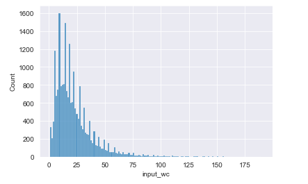
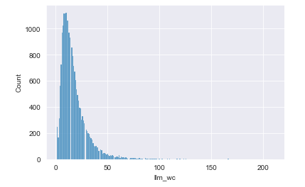
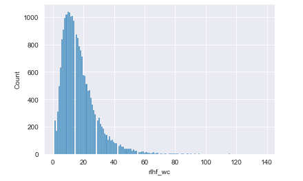

# ImmersiveEditor

## Overview

The ImmersiveEditor is a proof of concept project with the goal of training a series of models that can be used to take sentences evaluate their readability and rewrite the input sentences for easier readability. This can be thought of as the first feature implemented for a tool that will eventually have many similar functions that incorporate the editing of written text for specific audiences, style guides, or authorial voice.

## Methods

The workflow outlined above can be broken into five methods that we will be applying. These methods can be categorized as: readability calculation, sentence similarity calculation, rewritten sentence quality metrics, reinforcement learning with human feedback, and few-shot learning.

### Readability

The strategy that we will employ for calculating the readability of an input text will be to follow on from the progress made in the Kaggle competition for the CommonLit Readability Prize. Using the dataset from this competition we will train a model that can predict the readability of our future input data. The top scoring entry from this competition used a complex ensemble approach using large models to produce an RMSE of 0.446, we will set our acceptance criteria as 0.50 RMSE and using no more than three models due to the hardware limitations of working locally.

### Sentence Similarity

Determining the similarity between sentences is necessary for this project, as we will be using it to construct a rewrite quality metric which will allow us to generate some "Human Feedback" to bootstrap the process before we can retrieve human annotation for further RLHF tuning. Sentence similarity is a well explored problem, so we will be using a pretrained model without augmentation for generating this value.

### Rewrite Quality

We will compose a quality metric for rewrites using the readability and sentence similarity. Arbitrarily, the metric has been chosen to scale off of the readability improvement of the rewrite and the similarity to the original sentence. This means that we want sentences that are similar to the input but more readable and that we are willing to sacrifice some readability improvement for increased similarity.

### Rewrite using LLMs

Generating our first dataset will be accomplished by taking the input sentence as context with minimal instruction context on what to do (i.e. without examples) and measuring the output using the rewrite quality metric. If the metric is above a certain threshold we will "accept" the rewrite as a reasonable rewrite for the input sentence.

### Rewrite using RLHF fine-tuned LLMs

The RLHF process will require taking our dataset produced in the previous step and reformatting it into the form of `<sentence, chosen output, rejected output>`. For now this will be treated as our "Human Feedback" data, which will be handled by the annotation endpoints for future iterations. This process takes place in three stages. The first we do supervised fine-tuning on our model using the "Human Feedback" dataset. The second we train a reward model also using the "Human Feedback" dataset. Finally, we create actor and critic versions of the fine-tuned and reward models which are updated in concert with all four models running through a proximal policy optimization step.

### Rewrite using Few-shot learning LLMs

Our last model will be a much larger model than our RLHF model, since we do not have the constraint of needing to be able to run two copies of the RLHF model and is reward model in order to fine tune it we can use a much larger LLM. We add more context to the input by providing both instruction and two examples of accepted rewrites into the model. We will then compare how this method stacks up to our much smaller RLHF model.

### Observations

The following are word count distributions of the input sentence, and its rewrites using LLM or RLHF models.

Original sentences

LLM rewrite sentences

RLHF rewrite sentences

We can see that the number of words per sentence decreases when applying our rewrite models. The acceptance rate of our various models based on our "quality score" also increases depending on the preparation for the model. The general instruction LLM with no examples had an acceptance rate of 23.53%. The RLHF model had an acceptance rate of 30.79%, and the few-shot big LLM had an acceptance rate of 36.09%. It will be interesting to compare how these acceptance percentages change when moving to human annotation, as well as retraining our RLHF with real feedback in the future. Other notable observations are that the RLHF and LLM models used small vocabularies of total tokens than the input, some changes in frequency usage of parts of speech, and reductions in the number of ngrams produced. The calculations for these can be found in the jupyter notebook `eda.ipynb` in `research/readability-classification` and `research/rlhf-sample/RLHF`.
